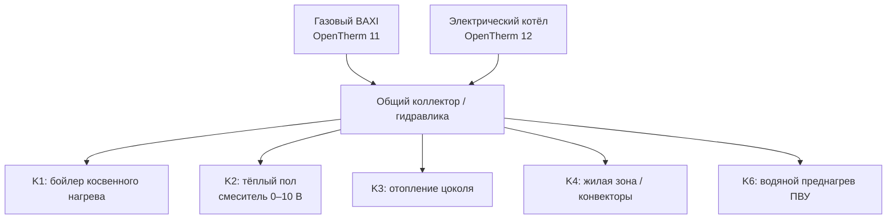
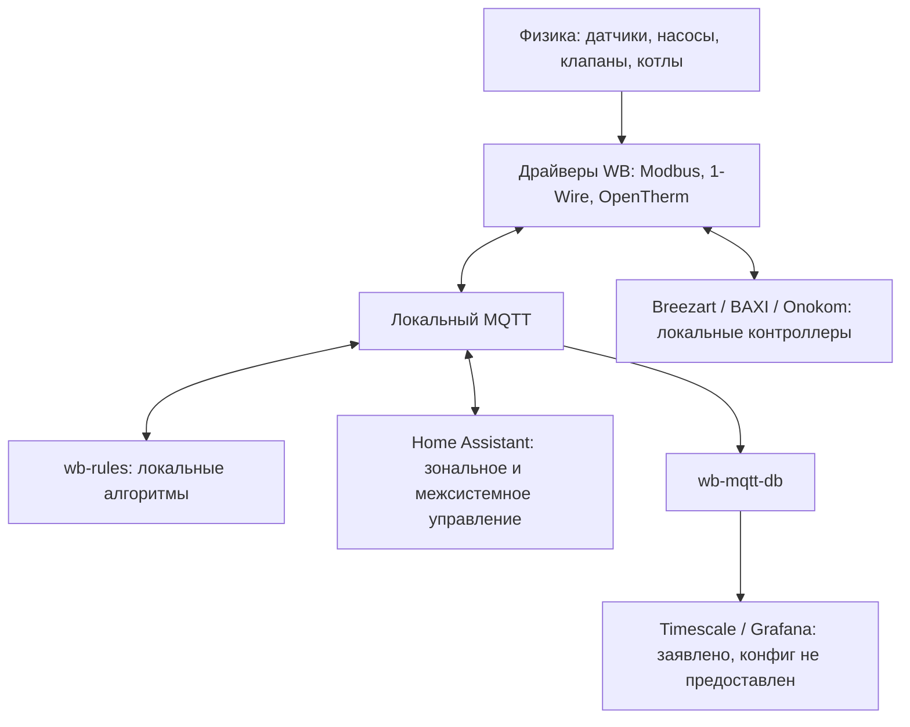

# 05 16 Исеть — полный архитектурный аудит системы автоматизации

**Дата аудита:** 02.09.2026  
**Режим работы:** evidence-first, до проектирования Heating Manager 2.0  
**GitHub snapshot:** `cddca795019a1d864dd7eb6df6ec19ba39adcd69`; последнее изменение каталога объекта — commit `04591bed184dcbb9c54176c3bce46f922de46e11` от 11.05.2026 21:13 +05:00.

## 0. Границы аудита и правила доказательности

Этот документ восстанавливает **существующую** архитектуру по доступным файлам, истории Git, проектным таблицам и инженерным схемам. Он не является проектом Heating Manager 2.0, не назначает новых владельцев каналов и не утверждает `MAX(request)` либо другую новую политику управления котлом.

На объекте **нет Sprut.hub**. Он не является участником архитектуры, не включён в карты уровней и ownership matrix. Встречающиеся в общих справочных материалах ссылки на него являются нерелевантным объекту наследием и не использованы как evidence.

Маркировка:

- **[Проверено]** — прямо подтверждено текущим объектным файлом, фактом из задания или фактически прочитанным проектным документом;
- **[Вывод из сопоставления]** — следует из нескольких согласующихся источников, но не проверено на работающем контроллере;
- **[Не могу проверить]** — нет конфигурации, телеметрии либо доступного документа, позволяющего подтвердить текущую реализацию.

Приоритет источников: подтверждённые факты задания → текущие конфиги и код объекта → кабельный журнал → проектные ТЗ 2025 года → более ранние проекты 2023–2024 годов → справочники производителей.

### 0.1. Каталог источников

| ID | Источник | Как прочитан | Роль |
|---|---|---|---|
| U1 | Текст текущей Work-задачи | полностью | Подтверждённые факты и обязательные ограничения |
| G1–G18 | Все 18 файлов `objects/05_16_Iset` | локальный checkout GitHub, полный реестр в разделе 12 | Текущая репозиторная реализация |
| H1 | История Git каталога объекта, commits `2e2466d`…`04591be` | `git log`, деревья, diffs, поиск каналов по всем ревизиям | Эволюция ролей и временные решения |
| P1 | `05 16 Исеть - Описание котельной.md` | полностью | Сводная физика котельной |
| P2 | `05 16 Исеть - Каналы Wiren Board.md` | полностью | Карта каналов и известные устаревшие UI-имена |
| P3 | `05 16 Исеть - Реестры каналов и устройств.xlsx` | все 4 листа, все непустые строки | Реальные подключения, виртуальные устройства, старая карта записи |
| Y1 | Яндекс.Диск `/ОВК/ОВ_07082024.pdf` | 12 страниц: извлечён текст, выборочно отрисована схема | Ранний проект отопления |
| Y2 | Яндекс.Диск `/ОВК/Корректировки/обвязка котла170925.pdf` | 2 страницы: извлечён текст, схема отрисована и просмотрена | Поздняя принципиальная обвязка котельной |
| Y3 | Яндекс.Диск `/Умный дом/управление ОВК/тз на автоматизацию ОВК 091025.xlsx` | все непустые строки | Последнее найденное ТЗ по отоплению/котельной |
| Y4 | Яндекс.Диск `/Умный дом/управление ВиК/тз на автоматизацию ВиК 091025.xlsx` | все непустые строки | Вентиляция, заслонки, кондиционирование |
| Y5 | Яндекс.Диск `/Умный дом/управление ЭОМ/тз на автоматизацию ЭОМ 091025.xlsx` | все непустые строки | Электропитание, АВР/ДГУ, нагрузки, HA |
| Y6 | Яндекс.Диск `/ВиК/2024-06-03 №2445 Екб., Дом 250 м2 Проект ВиК корректировки.pdf` | 9 страниц, извлечён текст | Физическая вентиляция и подача через конвекторы |
| Y7 | Яндекс.Диск, расчёты `Breezart 600 Aqua` и `Breezart 600 Extra` | 6 и 2 страницы, извлечён текст | Состав вентиляционных установок |
| Y8 | Яндекс.Диск, `монтаж и подключение ПВУ.xlsx`, `aqua_algorithm.pdf`, руководство интеграции Breezart/WB | прочитаны | Локальная автоматика ПВУ и интерфейс WB |
| Y9 | Яндекс.Диск, `baxi ampera.pdf`, `service_menu_diva.pdf`, `config-wbe2-i-opentherm.zip` | прочитаны; JSON шаблона распакован | Справочные данные; не доказательство фактической модели газового котла |
| Y10 | Яндекс.Диск, Hisense specification, Onokom link note, MyAVR manual, схема ATS | прочитаны | Состав СКВ и справочные материалы АВР |

Публичный корень инженерной документации: <https://disk.yandex.ru/d/0WUIgcKkBFqnIw>.

---

## 1. Инвентаризация всех инженерных систем

| Система | [Проверено] фактический/документальный состав | Текущий статус автоматизации | Evidence |
|---|---|---|---|
| Теплогенерация | Газовый BAXI ECO4S 18F, OpenTherm; отдельный электрический котёл и второй WBE2-I-OPENTHERM | Газовый котёл наблюдается и получает `Heating Setpoint` от WB. Для электрического котла нет найденного рабочего алгоритма включения/резервирования | U1; G5; G7–G8; Y2–Y3 |
| Гидравлика | Общий подающий/обратный коллектор после котлов; K1 бойлер; K2 тёплый пол; K3 цоколь; K4 жилая зона; K5 рециркуляция ГВС; K6 преднагрев ПВУ | K1–K4 имеют WB-алгоритмы. K5 только наблюдается/доступен вручную. Писатель K6 не найден | U1; G7–G11; G17–G18; P1–P3; Y2–Y3 |
| Тёплый пол | Единственный смесительный отопительный контур: насос K2, трёхходовой клапан 0–10 В, датчик подачи после смесителя, 5 приводов зон жилого этажа в текущем коде | Насос — `Heating_pumps_manager.js`; клапан — `Floor_mixing_control.js`; зональные приводы документально принадлежат HA | U1; G9, G11, G17–G18; Y2–Y3 |
| Отопление жилого этажа | Водяной прямой контур K4; 11 приводов коллектора. Основные приборы — внутрипольные конвекторы без собственных вентиляторов; часть принимает приточный воздух | Зональные приводы документально управляются HA; K4 включается WB по факту хотя бы одного открытого NO-привода | U1; G11, G17–G18; Y3, Y6 |
| Отопление цоколя | Отдельная группа K3; комнатные WB-MSW 45/61/202/209 | Временный WB-термостат управляет K3. Передача K3 в HA только запланирована | U1; G6, G10, G14, G17–G18; H1 |
| ГВС | Бойлер косвенного нагрева на отдельной ветви общего коллектора; насос K1; отдельный DS18B20 | `DHW_priority_manager.js` управляет K1 и уставкой газового котла; это не внутренний второй контур BAXI | U1; G5, G8, G10, G18; Y2–Y3 |
| Рециркуляция ГВС | Насос K5 | Алгоритм не найден; канал только читается, логируется и доступен в WB WebUI. Нельзя считать его heat-demand контуром | U1; G4, G7, G17–G18 |
| Приточная вентиляция | Breezart 600 Aqua, локальный CP-JL205/JL202; водяной нагреватель; воздушный клапан с возвратной пружиной; VAV-заслонки | Breezart доступен по Modbus как `breezart_lux_sb_115`. Уставка производительности доступна из WB/HA. Локальная автоматика ПВУ должна регулировать калорифер и защищать от замерзания. Путь команды к K6 не установлен | G5, G15–G18; Y4, Y7–Y8 |
| Вытяжная вентиляция | Vilpe ECo220P/160; вытяжные 0–10 В заслонки; отдельно проектировался Breezart 600 Extra для цоколя | `Vilpe_control.js` регулирует Vilpe и координирует часть заслонок при сушке. Основная зональная логика заслонок документально отнесена к HA. Алгоритм 600 Extra не найден | G15–G18; Y4, Y6–Y8 |
| Сауна | Электропечь, токи трёх фаз с WB-MAP12E; влажность; вытяжка/сушка | WB фиксирует режим печи по токам и запускает сушку. Питание печи документально управляется HA через `EXT1_K11` | G5, G15–G18; Y4–Y5 |
| Кондиционирование | 1 внешний Hisense, 4 внутренних блока, 4 шлюза Onokom HS-3-MB-B на RS-485 | Документально управление WB/HA через Onokom; отдельное питание наружного блока — `wb-mr3_36/K3`. Реальная HA-конфигурация отсутствует | G5, G17–G18; Y4–Y5, Y10 |
| Электроснабжение/АВР | ДГУ Daewoo, MyAVR; WB-MAP12E; мастер-контактор; управляемые нагрузки | В ТЗ предусмотрены мониторинг/ручной запуск из HA и сброс неважных нагрузок. Реализующий конфиг MyAVR/HA не найден; в WB WebUI есть контакторы, но нет алгоритма АВР | G5, G17–G18; Y5, Y10 |
| Защита от протечек | Заявлена в README; ТЗ требует отключать отдельные насосы/водоподготовку | Датчики, исполнительные краны, алгоритм и alarm-каналы в текущем каталоге не найдены | G1; Y3, Y5 |
| Купель | Локальный пульт AM D-S, водоподготовка и насос; питание контроллера `wb-mrm2-mini_19/K1` | Локальный пульт — базовый владелец процесса; HA документально включает питание/режим. Фактический интерфейс аварии не найден в текущих конфигурациях | G5, G17–G18; Y3, Y5 |
| Освещение | Релейные и диммерные группы, комнаты/фасад/ландшафт | WB содержит только мастер-выключение и двойное нажатие для четырёх линий цоколя; остальные способы управления лежат вне каталога | G12–G13, G17–G18; Y5 |
| Наблюдение и история | WB journal, wb-mqtt-db; Grafana/Timescale заявлены для объекта | Локальная MQTT-история настроена. Объектный `wb-cloud-agent`, datasource и dashboards Grafana недоступны | U1; G4; P1 |
| Уведомления | Стандартный WB Notification module | В репозитории настроен Telegram для 9 отопительных событий. Email-конфигурация не найдена | G3; P1 |

**[Вывод из сопоставления]** Система сейчас не является «WB плюс интерфейс». HA документально владеет значимой частью исполнительного уровня: зональными тепловыми приводами, воздушными заслонками, контакторами и кондиционированием. WB одновременно содержит локальные критичные контуры котельной и читает HA-управляемые приводы как входы для насосной логики. Источник: G6–G11, G15, G18, Y3–Y5.

---

## 2. Физическая карта

### 2.1. Котельная и гидравлика

K5 — отдельная рециркуляция ГВС; она не показана как потребитель тепла от общего коллектора. Бойлер K1 — внешняя ветвь коллектора, а не внутренний BAXI DHW/CH2. Это дополнительно согласуется с `boiler_mode: 3` и отключёнными DHW-каналами газового WBE2 в `wb-mqtt-serial.conf`. Evidence: U1, G5, Y2–Y3.

Проектная схема Y2 маркирует насосы как `ЦН1…ЦН8`. Эти номера **не равны** номерам выходов `K1…K6`; автоматическое сопоставление по цифре запрещено. По функциональному назначению WB K6 соответствует ветви водяного нагревателя ПВУ, которую схема обозначает `ЦН8`. Evidence: U1, G18, Y2–Y3.

### 2.2. Датчики котельной

| Канал | Физический смысл | Потребители |
|---|---|---|
| `wb-w1/28-00000fd7811a` | Температура бойлера | Boiler monitor, DHW manager |
| `wb-w1/28-00000fdeed15` | Температура линии цоколя | Boiler monitor |
| `wb-w1/28-00000fd6a9ad` | Наружная температура | Boiler monitor, погодная уставка подмеса |
| `wb-w1/28-00000ff8a3d5` | Подача после смесителя в коллектор ТП | Boiler monitor, floor mixing controller |
| `wb-w1/28-00000ff86391` | Температура линии жилой зоны | Boiler monitor |
| `wb-w1/28-00000ff8446c` | Подача системы после гидрострелки; накладной датчик | Boiler monitor, source guard подмеса |
| `wbe2-i-opentherm_11/*` | Статус, пламя, температура котла, давление, ошибки | Boiler monitor, DHW manager (setpoint) |

Evidence: G7–G9, G18, P1–P3. Накладное исполнение датчика подачи снижает доказательность точного ΔT и должно учитываться при диагностике.

### 2.3. Зоны, приводы и воздушные заслонки

- `wb-mio-gpio_195:2/K1…K11` — 11 NO-приводов прямого водяного контура жилой зоны; WB-менеджер K4 считает запросом наличие хотя бы одного `0` (открыто). G11, G18.
- `wb-mio-gpio_195:2/K12…K16` — 5 NO-приводов тёплого пола; WB-менеджер K2 использует ту же логику. G11, G17–G18.
- `wb-mao4_131/Channel 1` — единственный водяной смесительный клапан ТП; `%` больше означает больше горячей подачи. G9, P1.
- `wb-mao4_131/Channels 2…4` и `wb-mao4_204/Channel 3` — приточные заслонки парной, кабинета, гостиной и спальни. G17–G18.
- `wb-mao4_200/Channels 1…4`, `wb-mao4_220/Channel 1`, `wb-mao4_204/Channel 2` — вытяжные заслонки помещений. G17–G18.
- `wb-gpio/EXT1_K1`, `EXT1_K2` — дискретные заслонки цокольной вытяжки. G17–G18.

Проект ВиК подтверждает подачу воздуха через внутрипольные конвекторы в гостиную, мастер-спальню, гостевую/кабинет и ещё одну жилую зону. Теплоотдача конвекторов и расход приточного воздуха поэтому физически связаны, хотя алгоритм совместной координации в доступном коде отсутствует. U1, Y6.

### 2.4. Шины и контроллеры

| Интерфейс | Подтверждённые устройства |
|---|---|
| RS-485-1, 9600 | WB-MSW 45/61/202/209; WB-MAO4 131/204; WB-MR6CU 37/12; WB-MR6C 46; WB-MR3 36/107; WB-MRM2-mini 19; Breezart 115; WB-MAP12E 35 |
| RS-485-2, 9600 | WB-MSW 22/43/47/49/53/54/64/107/116; релейные модули 4/56/70/71/72/137; WBIO 195:1/195:2; WB-MAO4 200/220; Onokom 91–94; WB-MCM8 199 |
| `/dev/ttyMOD2`, 19200 | WBE2-I-OPENTHERM ID12, имя «Электрический котёл» |
| `/dev/ttyMOD3`, 19200 | WBE2-I-OPENTHERM ID11, имя «Газовый котёл» |
| MQTT | Общая шина между драйверами WB, wb-rules, WB WebUI и документально HA |

Evidence: G5, G17–G18.

---

## 3. Карта уровней системы

### 3.1. Wiren Board

**[Проверено]** WB является физическим I/O и локальным алгоритмическим уровнем для K1–K4, OpenTherm setpoint газового котла, подмеса ТП, Vilpe/сушки и двух световых сценариев. WB также агрегирует диагностику и публикует виртуальные устройства. G5–G15.

### 3.2. Home Assistant

**[Проверено документально]** Кабельный журнал назначает HA рабочим владельцем:

- 11 приводов отопления жилой зоны и 5 приводов ТП;
- приточных/вытяжных воздушных заслонок;
- `EXT1_K1/K2` цокольной вентиляции;
- мастер-контактора, питания электрического котла и печи сауны;
- питания наружного блока кондиционеров и управления внутренними блоками через Onokom;
- ряда вспомогательных нагрузок и купели.

**[Не могу проверить]** Репозиторий не содержит `configuration.yaml`, automations, MQTT discovery, entity registry, scripts/scenes или резервной копии HA. Поэтому невозможно подтвердить конкретные entity IDs, retained-команды, availability, таймауты, приоритеты и то, что перечисленная логика действительно развернута сейчас. G18; Y4–Y5.

**[Вывод из сопоставления]** HA общается с WB через MQTT: HA пишет физические WB-каналы, а WB-скрипты читают те же каналы и виртуальные устройства. Точный способ интеграции и QoS/retain не предоставлен. G11, G15, G18.

При падении HA обязаны продолжать работать локально и уже имеют WB-реализацию: мониторинг BAXI, K1/приоритет бойлера (если модуль включён), K2/K4 по сохранённым состояниям приводов, временный K3, подмес ТП, базовая логика Vilpe и локальные защиты Breezart/BAXI. Что произойдёт с зональными уставками и приводами после потери HA, не проверено.

### 3.3. Breezart и локальная вентиляция

Breezart 600 Aqua имеет собственную автоматику водяного нагревателя, поддержание температуры притока и защиту от замерзания. WB видит контроллер как Modbus-устройство 115. Проект предусматривает управление/наблюдение из WB/HA, но не замену локальных защит. G5, Y4, Y7–Y8.

Breezart 600 Extra найден в заказной и проектной документации как вытяжная установка цоколя. Отдельного Modbus-устройства Extra в `wb-mqtt-serial.conf` нет; её фактический управляющий сигнал/питание и алгоритм не установлены. G5, Y4, Y7.

### 3.4. BAXI/OpenTherm

Газовый BAXI выполняет локальные функции горелки, встроенной циркуляции и котловых защит. WB читает OT телеметрию и пишет `Heating Setpoint`. Насос котлового контура напрямую WB не виден. U1, G5, G7–G8.

Шапка `Boiler_room.js` и ТЗ 2025 года называют газовый котёл Ferroli Pegasus D45. Это устаревшая/конфликтующая идентификация; для текущего аудита принят подтверждённый пользователем BAXI ECO4S 18F. U1 против G7/Y3.

### 3.5. Кондиционеры и Onokom

Четыре Onokom HS-3-MB-B зарегистрированы на RS-485 адресах 91–94. Закупочная спецификация содержит один наружный и четыре внутренних блока Hisense. ТЗ назначает WB/HA управление через Onokom и отключение при ДГУ/пожаре. Реальные HA-правила и fail-safe шлюзов не предоставлены. G5, Y4–Y5, Y10.

### 3.6. Grafana/Timescale, уведомления и внешние сервисы

Наличие Grafana/Timescale задано как факт текущей Work-задачи, но объектные конфиги `wb-cloud-agent`, datasource, dashboards и список экспортируемых метрик отсутствуют. Подтверждён только локальный источник истории `wb-mqtt-db`. U1, G4.

`alarms.conf` настроен на Telegram, не на email. Email-получатели или SMTP/API-конфигурация не найдены. Конфиг содержит секрет доступа в открытом виде в репозитории; значение в этом аудите намеренно не воспроизводится. G3.

---

## 4. Ownership matrix

### 4.1. Теплоисточники, насосы и подмес

| Ресурс | Физический/MQTT-канал | Текущий писатель | Читатели / алгоритм | Конфликтующие писатели | Отказ владельца | UI | Логирование / уведомления | Evidence |
|---|---|---|---|---|---|---|---|---|
| Уставка газового котла | `wbe2-i-opentherm_11/Heating Setpoint` | `DHW_priority_manager.js` | Boiler monitor; DHW state machine; косвенно anti-cycle через `normal_setpoint` | Прямая запись из WB device UI возможна; HA-права не установлены. `Boiler_room.js` пишет настройку `dhw_priority_mgr/normal_setpoint`, то есть является вторым логическим писателем цели обычного режима | При остановке wb-rules котёл получает последнюю доставленную уставку; поведение BAXI при потере OT не проверено | WB devices + boiler dashboard | MQTT history; alarm только по OT fault/connection, не по расхождению команды | G4–G8, G17 |
| Электрический котёл, OT | `wbe2-i-opentherm_12/*` | Не найден | Драйвер Modbus публикует устройство | Не установлены | Нет подтверждённого автоматического резерва | Автогенерируемое WB-устройство; отдельной панели нет | Спецгруппа отопления не содержит OT12; уведомлений нет | G4–G5, G17 |
| Питание/разрешение электрического котла | `wb-gpio/EXT1_K10` | Документально HA | Не найден | WB WebUI даёт ручной доступ | При HA fault — неизвестно; локальный котёл может сохранить собственное состояние | Виджет «Контакторы» | Спецлогирования/alarms нет | G17–G18; Y5 |
| K1, бойлер | `wb-mr6cu_37/K1` | `DHW_priority_manager.js` | Boiler monitor; DHW manager | Ручной WB WebUI | На invalid DHW sensor менеджер выключает K1; при остановке скрипта физический выход остаётся в последнем состоянии до другого воздействия/перезапуска | Физический switch + DHW UI | MQTT history; DHW/boiler alarms | G3–G4, G7–G8, G17 |
| K2, тёплый пол | `wb-mr6cu_37/K2` | `Heating_pumps_manager.js` | Floor mixing читает состояние; Boiler monitor | Ручной WB WebUI. Старый DHW manager был писателем, но удалён из этой роли commit `794e8cf` | Без HPM остаётся последнее аппаратное состояние; при ложном `false` любого NO-привода HPM считает запрос активным | Физический switch; virtual status | MQTT history; косвенная диагностика подмеса | G7, G9–G11, G17; H1 |
| K3, цоколь | `wb-mr6cu_37/K3` | `Basement_radiator_thermostat.js` (временно) | Boiler monitor; 4 WB-MSW температуры | Ручной WB WebUI; будущая HA-роль ещё не введена | При отсутствии всех 4 температур K3 выключается. При остановке скрипта остаётся последнее состояние | Физический switch; временный thermostat vdev | MQTT history; отдельного alarm/email нет | G4, G6–G7, G10, G17 |
| K4, жилая зона | `wb-mr6cu_37/K4` | `Heating_pumps_manager.js` | Boiler monitor; состояния 11 NO-приводов | Ручной WB WebUI | HA fault замораживает/нарушает зональные команды; HPM продолжает вычислять K4 из доступных физических состояний | Физический switch; virtual status | MQTT history; отдельного alarm нет | G4, G7, G11, G17–G18 |
| K5, рециркуляция ГВС | `wb-mr6cu_37/K5` | **Не найден** | Boiler monitor только читает | Ручной WB WebUI; возможный HA писатель не доказан | Неизвестно; это не heat demand | Физический switch | MQTT history; уведомлений нет | U1; G4, G7, G17–G18 |
| K6, преднагрев ПВУ | `wb-mr6cu_37/K6` | **Критический пробел: не найден** | Boiler monitor только читает; проект связывает процесс с CP-JL205/Breezart | Ручной WB WebUI; HA/Breezart как фактический writer не доказаны | Локальная защита калорифера существует на уровне Breezart, но судьба насоса K6 при отказах неизвестна | Физический switch | MQTT history; alarm/notification нет | U1; G4, G7, G17–G18; H1; Y3–Y4, Y8 |
| Клапан подмеса ТП | `wb-mao4_131/Ch1 Switch`, `Dimming Level` | `Floor_mixing_control.js` | Boiler monitor; температура после смесителя, source/outdoor temp, K2 | Прямой WB device UI; `floor_mixing_ctrl/valve_position` в панели также выглядит writable | 3 плохих показания — alarm и закрытие; hard max — закрытие; K2 off/disable — закрытие. При остановке wb-rules аппаратный выход удерживает последнее состояние, если иной аппаратный fallback не задан | Полная сервисная настройка + dashboard | Физический канал и часть vdev в MQTT history; alarm не включён в `alarms.conf` | G4, G7, G9, G17 |
| Anti-cycle state | `boiler_room_boiler/ch_pause_*`; `dhw_priority_mgr/normal_setpoint` | `Boiler_room.js` | DHW manager читает pause и меняет физический setpoint | Оператор может менять `normal_setpoint`; сам DHW manager считает его своей настройкой | Состояние anti-cycle в RAM и теряется при restart; DHW manager продолжает с восстановленным vdev/default | Boiler dashboard | Часть vdev логируется; уведомления нет | G7–G8, G17 |
| DHW pause bus | `dhw_priority_mgr/heating_pause_mode` | `DHW_priority_manager.js` | HPM и basement thermostat | Нет найденных | Если DHW script исчезает, последние виртуальные значения могут сохраниться; отсутствие heartbeat не обрабатывается | Несколько vdev/widgets, часть имён устарела | Не включён явно в спецгруппу; уведомление только общий DHW alarm | G8, G10–G11, G17 |

### 4.2. Зональное отопление и датчики

| Ресурс | Канал | Текущий писатель | Читатели / алгоритм | Конфликт | Отказ | UI | История/уведомления | Evidence |
|---|---|---|---|---|---|---|---|---|
| 11 NO-приводов жилой зоны | `wb-mio-gpio_195:2/K1…K11` | Документально HA | HPM: `0=open=request`, управляет K4 | Ручной WB WebUI | Нет подтверждённого HA watchdog. Потеря/ошибка чтения трактуется HPM как `false`, то есть как открытый контур/запрос | Коллектор радиаторов | В спецгруппе перечислены только K1…K9; alarms нет | G4, G11, G17–G18 |
| 5 NO-приводов ТП | `wb-mio-gpio_195:2/K12…K16` | Документально HA | HPM управляет K2; floor controller читает только K2 | Ручной WB WebUI | Аналогично; нет подтверждённой проверки механического открытия | Коллектор ТП | Не перечислены в спецгруппе отопления; alarms нет | G4, G11, G17–G18 |
| Температуры комнат | `wb-msw-v4_* /Temperature` | Датчики | HA-зональные алгоритмы документально; WB K3 читает 45/61/202/209 | Нет | K3 выключается только если потеряны все 4; поведение HA не известно | Комнатные/климатические dashboards | Общая MQTT history по правилам default; спецalarms нет | G5–G6, G17–G18 |

### 4.3. Вентиляция, заслонки и сауна

| Ресурс | Канал | Текущий писатель | Читатели / алгоритм | Конфликтующие писатели | Отказ владельца | UI | История/уведомления | Evidence |
|---|---|---|---|---|---|---|---|---|
| Breezart 600 Aqua setpoint | `breezart_lux_sb_115/setpoint_fan_performance` | Документально локальный пульт/WB/HA | `Vilpe_control.js` читает как master airflow target | Несколько разрешённых интерфейсов без найденного арбитра | При потере данных Vilpe удерживает fallback; локальная автоматика Aqua остаётся самостоятельной | Dashboard вентиляции | Не включён в спецгруппу; Vilpe service flag не подключён к alarms | G5, G15–G17; Y4, Y8 |
| Vilpe speed/power | `wb-mao4_220/Ch2 Dimming`, `Switch` | `Vilpe_control.js` | Режимы normal/high/very high/drying | Ручной WB UI; возможный HA доступ | Нет Breezart/влажности — safe hold; полный restart восстанавливает drying state из vdev; физической обратной связи вентилятора нет | Dashboard и `vilpe_control_v3` | Physical speed в группе «Сауна»; target ошибочно ссылается на `vilpe_control_v1`; alarms не настроены | G4, G15–G17 |
| Координируемые вытяжные заслонки | `wb-mao4_200/Ch1…4 Dimming`, `wb-mao4_220/Ch1 Dimming` | HA по кабельному журналу **и** `Vilpe_control.js` во время сушки | HA зональная вентиляция; WB drying coordinator | **Подтверждённый конфликт writers**. При выходе из сушки WB восстанавливает старый snapshot и может затереть изменение HA | Не определён ownership/lock/heartbeat; switch-каналы этих заслонок WB drying не синхронизирует | Прямые WB widgets | Нет профильной MQTT-группы/alarms | G15–G18; Y4 |
| Остальные приточные/вытяжные заслонки | MAO4 131 Ch2–4; 204 Ch2–3; switch+dimming | Документально HA | Зональные условия WB-MSW; связь с конвекторами | Ручной WB UI | HA fail → последнее состояние; механическая обратная связь не найдена | Прямые WB widgets | Нет профильных alarms | G17–G18; Y4, Y6 |
| Цокольная вытяжка | `wb-gpio/EXT1_K1/K2`; Breezart Extra 600 | Документально HA / локальная вентиляция | CO/VOC/presence по ТЗ | Ручной WB UI | Реальный алгоритм и связь с Extra не найдены | Dashboard «Вытяжная вентиляция Breezart 2» | Нет специальной истории/alarms | G17–G18; Y4, Y7 |
| Сауна: токи | `wb-map12e_35/Ch2 Irms L1…L3` | Измерение | `Vilpe_control.js` определяет «сауна была включена» и drying condition | Нет | Потеря во время сушки допускается 180 с, затем сушка останавливается; вне сушки только service flag | vdev Vilpe | Не включены в группу «Сауна»; alarm service не маршрутизирован | G15–G16 |
| Питание печи | `wb-gpio/EXT1_K11` | Документально HA | Локальный контроллер печи; WB только косвенно видит токи | Ручной WB UI | Не установлено | «Контакторы» | Нет alarm | G17–G18; Y5 |

### 4.4. Прочие ресурсы

| Ресурс | Канал/интерфейс | Текущий писатель | Алгоритм/читатели | Конфликт/отказ | UI/история/уведомления | Evidence |
|---|---|---|---|---|---|---|
| Кондиционеры | Onokom 91–94; `wb-mr3_36/K3` | Документально HA; локальные контроллеры блоков | WB/HA через Modbus, power shedding по ТЗ | Реальный HA automation отсутствует; ручной WB power switch способен конфликтовать | Dashboard «Кондиционеры» содержит только power; alarms нет | G5, G17–G18; Y4–Y5, Y10 |
| MyAVR/ДГУ | Не найденный в WB config Ethernet/SNMP/дискретный интерфейс | Локальный MyAVR; HA планировался как remote control | Переключение сети/ДГУ локально | Реализация HA, обратная связь и load shed не найдены | Нет объектного dashboard/alarm в G17 | G1, Y5, Y10 |
| Протечки | Не установлено | Не установлено | В ТЗ только требования аварийного отключения | Полная непроверяемость | Нет channels/UI/alarms | G1; Y3, Y5 |
| Купель | `wb-mrm2-mini_19/K1` + локальный AM D-S | Локальный пульт; HA документально по питанию | Water treatment/heat local | Интерфейс аварии и heating request не найден | WB dashboard «Купель»; alarms нет | G17–G18; Y3, Y5 |
| Световые сценарии | перечисленные реле MR6C/MR6Cv3 | `Light_4.js`, `Master-Light.js`; ручное/HA возможно | Double press включает 4 линии цоколя; long press выключает выбранные линии | Прямой WB/HA доступ; единого ownership нет | Комнатные dashboards; application logging отсутствует | G12–G13, G17; Y5 |

---

## 5. Межсистемные зависимости

1. **Отопление помещений → насосы.** HA управляет NO-приводами, а WB читает их фактические MQTT-состояния и включает K2/K4. Это жёсткая межсистемная зависимость HA → WB. G11, G18.
2. **ГВС → всё отопление.** DHW manager публикует `heating_pause_mode`; WB-менеджеры K2/K3/K4 останавливают отопление в `priority_heat` и `restore`. K1 и OT setpoint принадлежат самому DHW manager. G6, G8, G10–G11.
3. **Anti-cycle monitor → DHW manager → котёл.** `Boiler_room.js`, заявленный как monitor-only, меняет `dhw_priority_mgr/normal_setpoint`; DHW manager затем пишет физический OT setpoint. Это скрытая управляющая цепочка и нарушение заявленного разделения monitor/control. G2, G7–G8.
4. **ПВУ → K6.** Проект требует, чтобы локальный Breezart управлял нагревательным контуром и сообщал статус по Modbus. Но физический путь к WB K6 не найден. Y3–Y4 против G5/G7/G18.
5. **Приток → внутрипольные конвекторы.** Приточный воздух проходит через часть конвекторов. Положение воздушной заслонки влияет на воздушный поток и теплоотдачу, тогда как водяной привод влияет на расход теплоносителя. Координирующий алгоритм не предоставлен. U1, Y4, Y6.
6. **Breezart airflow → Vilpe.** WB вычисляет скорость Vilpe относительно уставки Breezart и изменяет её по влажности/сушке. G15–G16.
7. **Сауна → общая вытяжка.** Токи печи запускают drying coordinator, который временно пишет сразу в несколько вытяжных заслонок, документально принадлежащих HA. G15–G18.
8. **ДГУ → HVAC/электрокотёл/купель.** ТЗ требует отключать электрический котёл, печь, вентиляцию, купель, кондиционеры и некритичное освещение при переходе на ДГУ. Реализующая автоматика не найдена. Y4–Y5.
9. **Протечка → насосы/купель/ХВС.** В ТЗ есть требования, но нет найденного event source или правил. Y3, Y5.

---

## 6. Статус прежних решений

| Решение | Статус | Обоснование |
|---|---|---|
| BAXI ECO4S 18F как текущий газовый котёл | **Подтверждено** | U1 |
| Ferroli Pegasus D45 в `Boiler_room.js` и ТЗ | **Устарело / конфликтует** | G7/Y3 против U1 |
| Электрический котёл как аварийный/резервный | **Проектно подтверждено, фактический алгоритм не найден** | Y2–Y3; G5 |
| Бойлер как внешний контур K1 | **Подтверждено** | U1; G8/G18; Y2–Y3 |
| CH2/internal DHW BAXI для бойлера | **Не относится к фактической схеме** | U1; G5 |
| K2/K4 у единого pump manager | **Подтверждено текущим кодом** | G11; H1 |
| Старый DHW manager как writer K2/K3/K4 | **Устарело** | Удалено commit `794e8cf`; P3 сохранил старую карту |
| K3 во временном WB thermostat | **Временно, действует по репозиторию** | G6/G10 |
| Передача K3 в HA | **Запланировано, не подтверждено как выполненное** | G10; HA config отсутствует |
| `Boiler_room.js` как чистый monitor-only | **Конфликтует с реализацией** | Пишет `dhw_priority_mgr/normal_setpoint`; G2/G7 |
| Один writer OT Heating Setpoint | **Внутри JS-каталога подтверждено; системно не гарантировано** | G8; прямой device UI и неизвестные HA-права остаются |
| Один writer клапана ТП | **Внутри JS-каталога подтверждено; UI допускает ручную запись** | G9/G17 |
| HA ownership зональных приводов и заслонок | **Документально подтверждено, runtime не проверен** | G18 |
| Vilpe v3 как текущий файл | **Подтверждено** | G14–G16; H1 |
| Vilpe coordinator без writer conflict | **Опровергнуто** | Пересечение HA ownership и WB writes; G15/G18 |
| `heating_ui_*` / `boiler_ui_*` витрина | **Устарело/частично сломано** | Скрипта-создателя нет, а WebUI продолжает ссылаться на часть каналов; G17, P2–P3 |
| Notification module покрывает систему | **Частично** | Только 9 отопительных alarm inputs, без floor/vilpe/K6/HA/AVR; G3 |
| Email-уведомления | **Не подтверждено** | В доступном объектном конфиге только Telegram; G3 |
| Grafana/Timescale как история объекта | **Заявлено, конфигурация не предоставлена** | U1; G4 подтверждает только local DB |

---

## 7. Системный слой событий, аварий и уведомлений

### 7.1. Что существует

`Boiler_room.js` создаёт 8 boolean alarm states: OT connection, boiler fault, low pressure, overheat, no heat pickup, poor circulation, DHW heating problem, floor mixing problem. `DHW_priority_manager.js` создаёт общий alarm. `alarms.conf` подписан на эти 9 состояний, задаёт задержки и отдельные тексты возникновения/восстановления. G3, G7–G8.

`Floor_mixing_control.js` и `Vilpe_control.js` также публикуют alarm/service flags, но они не подключены к `alarms.conf`. G3 против G9/G15.

### 7.2. Классификация фактически реализованных событий

| Источник | Событие | Реальный уровень | Владелец состояния | Дедупликация/восстановление | Доставка |
|---|---|---|---|---|---|
| Boiler monitor | OT fault/loss, pressure, overheat, circulation, heat pickup | Только boolean; severity явно не хранится | `Boiler_room.js` | Signature фиксирует время изменения; Notification config содержит recovery text | Telegram |
| DHW manager | Sensor/pump/timeout/state fault | Boolean + text | `DHW_priority_manager.js` | Alarm сбрасывается при успешном переходе; Notification recovery text | Telegram |
| Floor mixing | Sensor invalid/hard maximum | Boolean + text | `Floor_mixing_control.js` | Локальный latch/clear по циклу; внешней доставки нет | Только WB UI/MQTT |
| Vilpe | Breezart/humidity/current/startup flags | Несколько boolean + text/event | `Vilpe_control.js` | Частично хранится vdev; внешней доставки нет | Только WB UI/MQTT |
| HA/Breezart/K6/AVR/AC/leak | Не найдено | — | — | — | — |

### 7.3. Пробелы относительно системного слоя

- Нет единой, доказанной классификации `alarm/warning/info`; текущий Notification config понимает только «expected value / alarm / recovery».
- Нет heartbeat/availability владельцев WB scripts, HA, Breezart и Grafana export.
- Нет корреляции alarm с фактической командой, snapshot входов и подтверждением физического исполнения.
- Нет email-маршрута и доказанного механизма эскалации.
- В текущих JS-файлах отсутствуют вызовы `log.info/warning/error`; причины решений остаются только в изменяемых status text.
- В репозитории хранится действующий на вид Telegram credential. Его необходимо считать скомпрометированным и ротировать отдельно; значение не включено в документ.

**Требование, выявленное аудитом, без проектирования нового модуля:** существующий паттерн «подсистема владеет canonical alarm state, центральная конфигурация маршрутизирует уведомление» уже присутствует и не требует переписывать Notification module под каждую подсистему. До развития нужно определить единый контракт полей, severity, recovery и deduplication и подключить существующие, но сейчас немаршрутизируемые flags. Это фиксация пробела/контракта, не новая реализация.

---

## 8. Логирование и история

### 8.1. WB journal / `wb-rules.service`

**[Проверено]** В текущих семи JS-файлах объекта нет ни одного вызова `log.info`, `log.warning` или `log.error`. Поэтому journal способен показать загрузку/ошибки движка, но не формирует предметную трассу «вход → решение → команда → результат». G6–G15.

### 8.2. `wb-mqtt-db`

`/var/lib/wirenboard/db/data.db` содержит общую группу и специализированные группы:

- «Отопление»: 120-секундный minimum interval, 1200 секунд для неизменившегося значения, `values_total=1 200 000`; температуры, OT11, K1–K6, часть приводов и виртуальной диагностики;
- «Сауна»: humidity 64, физическая скорость Vilpe и **устаревший** `vilpe_control_v1/target_vilpe_setpoint`; токи сауны и v3 flags не перечислены.

Заявление P1 «около 4 недель» является намерением, а не доказанной retention policy: фактическая глубина зависит от объёма записей и работы `wb-mqtt-db`. G4, P1.

Пробелы группы отопления: нет OT12 электрического котла; нет K10–K16 приводов; нет `heating_pause_mode`; не все floor/Vilpe alarm flags; stale `v1` channel. G4.

### 8.3. Timescale/Grafana

**[Не могу проверить]** Не предоставлены конфиг агента выгрузки, host/controller mapping, SQL views/dashboards, период отправки, retention, alert rules и список пользователей. Нельзя доказать, какие именно MQTT topics доходят до Timescale и какие графики доступны заказчику/сервису. U1.

### 8.4. Назначение слоёв

- Physical MQTT history отвечает на вопрос «что было на канале».
- WB journal должен отвечать «почему алгоритм принял решение», но текущие scripts этого не записывают.
- Grafana/Timescale должна давать долгую корреляцию систем, но её объектная конфигурация не проверена.
- Изменяемые `status_text/event_text` полезны для текущего UI, но не заменяют неизменяемый журнал событий.

---

## 9. Fail-safe объекта

| Отказ | [Проверено] существующее поведение | [Не могу проверить] / риск |
|---|---|---|
| Потеря WB controller | Локальные BAXI/Breezart/Onokom controllers сохраняют собственные базовые функции. Физические outputs теряют центральную координацию | Положение всех outputs после полного обесточивания; значение `outputs_restore_state=1` у MR6CU37 найдено, но его фактическая семантика/проверка на объекте отсутствует |
| Падение `wb-rules` | MQTT drivers и ручной WB UI могут остаться; физические outputs обычно сохраняют последнее значение. Локальные алгоритмы K1–K4, floor, Vilpe прекращаются | Нет общего watchdog scripts; stale `heating_pause_mode`; клапан подмеса может остаться в последнем положении до аппаратного/ручного действия |
| Потеря HA | WB heating modules, временный K3, floor control, boiler monitoring и Vilpe продолжают исполняться по доступным MQTT-состояниям | Зональные приводы/заслонки/AC/контакторы перестают получать решения; нет HA heartbeat и fallback. K2/K4 могут продолжить по «замороженным» состояниям приводов |
| Потеря интернета | Локальные WB/HA/BAXI/Breezart функции не требуют доказанного внешнего облака | Удалённый доступ, внешние уведомления и Timescale/Grafana могут быть недоступны; email не подтверждён |
| Потеря Breezart data | Vilpe использует last applied → last valid → current setpoint → actual → 15%; публикует error flags | K6 writer неизвестен; safe state водяного насоса и воздушных заслонок не доказан |
| Потеря OpenTherm газового котла | Boiler monitor выставляет `invalid_connection`; Notification config имеет немедленное сообщение | DHW manager не проверяет OT availability перед записью и продолжает state machine; автоматического перехода на электрический котёл не найдено |
| Потеря OT электрического котла | Нет зависящего от него WB-алгоритма | Нет alarm, history group и подтверждённого резерва |
| Потеря DHW DS18B20 | DHW manager выключает K1 и возвращает setpoint в safe normal | Если manager disabled/default false, фактическое поведение определяется сохранённым vdev и ручными действиями; runtime value неизвестен |
| Потеря floor supply DS18B20 | До bad limit удерживается last good/position; после limit закрывает valve и ставит alarm | Floor alarm не отправляется внешне |
| Потеря outdoor sensor | Floor weather calculation возвращает текущую сохранённую уставку | Нет alarm только по outdoor sensor; оператор может не заметить degraded mode |
| Потеря source temp | Source guard блокирует дальнейшее открытие | Не подтверждено, достаточно ли этого для всех механических отказов |
| Потеря MQTT broker | Все `dev[]` связи и rules dependencies нарушаются | Не проведён тест: outputs могут остаться в последних состояниях; нет system-level MQTT watchdog |
| Потеря питания | BAXI/Breezart имеют локальные безопасные controllers; часть WB modules содержит power-up/restore settings | Реальные положения NO-приводов, 0–10 В actuator и контакторов после возврата питания не зафиксированы протоколом испытаний |
| Отказ насоса | Boiler monitor выводит косвенные alarms по температурному росту/ΔT для K1/floor и no heat pickup | Нет доказанной обратной связи тока K1–K6; channel ON не доказывает вращение |
| Заклинивание клапана/заслонки | Floor имеет температурный hard max и косвенную проверку роста | Нет position feedback; для воздушных заслонок нет контроля исполнения |
| Пожарная тревога | ТЗ требует выключения вентиляции/AC и других нагрузок | Event source, writers и сценарий не найдены |
| Протечка | ТЗ требует отключать ряд насосов/купель | Датчики, краны и алгоритм не найдены |

---

## 10. UI и операторские функции

### 10.1. Что видит заказчик в WB WebUI

15 dashboards: помещения, весь свет, вентиляция, отопление, котельная, электромониторинг, кондиционеры. Котельная показывает физические насосы, OT состояние, температуры, ΔT, DHW и floor data. G17.

Проблемы текущего UI:

- Виджеты K1–K6 используют прямые физические `switch` и позволяют ручную запись поверх алгоритмов.
- Виджет котла показывает service setting `min_supply_setpoint`, которая через Boiler monitor меняет DHW normal setpoint.
- DHW widgets всё ещё ссылаются на удалённые `heating_paused` и `priority_active` вместо текущих `heating_pause_mode/active`.
- Floor/alarms widgets ссылаются на отсутствующие `heating_ui_*`; соответствующего script нет.
- «Кондиционеры» показывает только питание наружного блока, а не подтверждённые Onokom entities.
- Нет отдельного runtime status электрического котла, K6 owner, HA availability, MyAVR, leak protection и Grafana link/status.

### 10.2. Где меняются уставки

| Уставка | Доступные места | Источник истины сейчас |
|---|---|---|
| OT Heating Setpoint | Physical WB device; DHW manager | Физический channel, writer в JS — DHW manager; внешние права не ограничены доказанно |
| Обычная котловая уставка | `dhw_priority_mgr/normal_setpoint`; косвенно `boiler_room_boiler/min_supply_setpoint` | Конфликтующий/двухступенчатый contract: Boiler monitor переписывает DHW setting |
| DHW thresholds/target | `dhw_priority_mgr/*` | Vdev DHW manager; фактические persisted values не предоставлены |
| Floor setpoint/curve | `floor_mixing_ctrl/*` | Floor vdev; weather mode сам перезаписывает visible `setpoint` |
| Room temperatures | HA, по кабельному журналу/ТЗ | HA configuration недоступна |
| Breezart airflow | Локальный пульт, WB WebUI, HA по ТЗ | Не определён единый arbiter |
| Vilpe thresholds/drying | `vilpe_control_v3/*` | WB vdev |

### 10.3. Заказчик против сервисного инженера

Текущий WB WebUI не проводит доказанной границы полномочий: эксплуатационные dashboards содержат физические switches и service ranges. Роли/ACL WB и HA не предоставлены. Поэтому невозможно подтвердить, что заказчик не может обойти automation owner. Сервисные vdev подробно показывают состояния, но без decision log расследование опирается на графики и текущий текст.

---

## 11. Полный перечень неизвестных и пробелов

### Критические

1. **Кто фактически пишет `wb-mr6cu_37/K6`.** В текущем GitHub и во всех ревизиях объекта writer отсутствует. HA config отсутствует; связь Breezart → K6 не показана.
2. **Фактическая роль электрического котла.** Проектно — аварийный резерв; физически есть OT12 и контактор HA. Не найден алгоритм обнаружения отказа газа, разрешения резерва, setpoint, interlock, подтверждения включения и возврата.
3. **Текущий HA configuration и live state.** Без него нельзя подтвердить зональные термостаты, damper logic, K5/K6, AC, AVR, leak protection и fail-safe.
4. **Writer conflict ventilation.** HA и `Vilpe_control.js` пишут в одни и те же dimming channels; отсутствуют lock, lease, owner state и merge policy.
5. **Переход на ДГУ и load shedding.** Требования есть, реализации нет в доступных материалах.
6. **Протечки.** Заявлены система и последствия, но нет карты датчиков/кранов/алгоритма.

### Высокие

7. Репозиторная копия объекта не менялась после 11.05.2026; нет доказательства byte-to-byte соответствия текущему контроллеру.
8. Нет live export `/etc/wb-rules`, HA backup, retained MQTT state, `systemctl` status, package versions и перечня активных services.
9. `DHW_priority_manager/enabled` имеет default `false`; фактическое persisted значение на объекте неизвестно.
10. Нет подтверждения, что runtime physical output K1–K6 соответствует labels после возможной перекоммутации.
11. Непроверенные power-up states всех реле/AO; нет протокола blackout/recovery test.
12. Нет механической обратной связи приводов и большинства pumps; status channel показывает команду, не результат.
13. `Boiler_room.js` содержит неактуальную модель котла и одновременно скрыто влияет на управление.
14. Нет общего heartbeat/availability и alarm для HA, MQTT, wb-rules, Breezart, OT12, K6.

### Средние

15. `alarms.conf` не включает floor/Vilpe flags, не содержит severity и email.
16. Telegram credential хранится открыто в repo.
17. MQTT DB имеет stale channels и неполное высокочастотное покрытие; retention не измерена.
18. Grafana/Timescale object configuration и фактическая глубина истории недоступны.
19. WebUI содержит stale/broken `heating_ui_*`, `heating_paused`, `priority_active` references.
20. Нет стандартизированного application logging в current scripts.
21. Нет доказанного алгоритма K5 recirculation.
22. Не установлен фактический алгоритм Breezart Extra 600 и цокольных заслонок.
23. Не проверены права пользователей/ACL и разграничение customer/service UI.
24. Адрес `46` как WB-MSW из старых заметок конфликтует с текущим WB-MR6C; датчиком его считать нельзя. P2, G5.

### Недоступность инженерных документов

Публичная структура Яндекс.Диска была открыта, перечислены основные разделы и фактически прочитаны релевантные файлы Y1–Y10. Не каждый справочник производителя внутри большой папки был скачан: это не требуется для доказательства текущего ownership. Не удалось получить ни одного файла с runtime HA configuration, актуальной схемой MQTT integration, конфигом Grafana/Timescale или as-built протоколом K6 — таких документов в просмотренных релевантных разделах не найдено.

---

## 12. Реестр ВСЕХ файлов `objects/05_16_Iset`

На GitHub snapshot найдено **18 файлов**. Все 18 фактически открыты: текстовые файлы прочитаны/структурно разобраны, JSON полностью распарсен, XLSX прочитан по всем листам и непустым строкам. В `wb-webui.conf` встроенный демонстрационный SVG технически распарсен как часть JSON, но его base64/векторное содержимое не использовалось как архитектурное evidence.

| № | Путь | Статус | Архитектурная роль |
|---:|---|---|---|
| 1 | `objects/05_16_Iset/README.md` | **прочитан** | Верхнеуровневый перечень систем |
| 2 | `objects/05_16_Iset/arh_iset.md` | **прочитан** | Заявленная модульная архитектура; содержит расхождения с кодом |
| 3 | `objects/05_16_Iset/Doc/Кабельный журнал 05-16 v2.xlsx` | **прочитан** | Физические каналы и документальные owners HA/WB |
| 4 | `objects/05_16_Iset/etc/alarms.conf` | **прочитан** | Notification mapping; секрет намеренно не воспроизведён |
| 5 | `objects/05_16_Iset/etc/wb-mqtt-db.conf` | **прочитан** | Локальная история MQTT |
| 6 | `objects/05_16_Iset/etc/wb-mqtt-serial.conf` | **прочитан** | Modbus topology, два OpenTherm, Breezart, Onokom, WB modules |
| 7 | `objects/05_16_Iset/etc/wb-webui.conf` | **прочитан** | Dashboards, widgets, direct operator write surfaces |
| 8 | `objects/05_16_Iset/etc/wb-rules/README.md` | **прочитан** | Навигатор active scripts |
| 9 | `objects/05_16_Iset/etc/wb-rules/Heating.md` | **прочитан** | Current intended K1–K4 ownership, planned K3 transfer |
| 10 | `objects/05_16_Iset/etc/wb-rules/Basement_radiator_thermostat.js` | **прочитан** | Temporary K3 writer |
| 11 | `objects/05_16_Iset/etc/wb-rules/Boiler_room.js` | **прочитан** | Monitoring, alarms, anti-cycle and indirect setpoint influence |
| 12 | `objects/05_16_Iset/etc/wb-rules/DHW_priority_manager.js` | **прочитан** | K1 and gas OT setpoint writer |
| 13 | `objects/05_16_Iset/etc/wb-rules/Floor_mixing_control.js` | **прочитан** | Floor mixing valve writer |
| 14 | `objects/05_16_Iset/etc/wb-rules/Heating_pumps_manager.js` | **прочитан** | K2/K4 writer based on NO actuators |
| 15 | `objects/05_16_Iset/etc/wb-rules/Light_4.js` | **прочитан** | Basement light double-press scenario |
| 16 | `objects/05_16_Iset/etc/wb-rules/Master-Light.js` | **прочитан** | Selected whole-house light off scenario |
| 17 | `objects/05_16_Iset/etc/wb-rules/Vilpe_control.js` | **прочитан** | Vilpe, humidity modes, sauna drying coordinator |
| 18 | `objects/05_16_Iset/etc/wb-rules/Vilpe_control.md` | **прочитан** | Documented Vilpe behavior and stated HA flags |

Ни один файл не имеет статуса «не удалось открыть». Ни один не исключён как «не относится к архитектуре»: даже световые scripts и demo-heavy WebUI влияют на общую карту writers/UI и потому прочитаны.

---

## A. [Проверено] — фактическая текущая архитектура

1. Доказанные уровни текущей системы: WB, документально назначенный уровень HA, локальная автоматика BAXI/OpenTherm и Breezart, MQTT и локальная history. Onokom/HA, MyAVR/HA, Grafana/Timescale и email требуют runtime-подтверждения.
2. WB имеет два WBE2-I-OPENTHERM: ID11 газовый, ID12 электрический. Текущий газовый котёл — BAXI ECO4S 18F; строки о Ferroli устарели.
3. Единственный водяной смесительный отопительный контур — K2 тёплого пола; его клапаном 0–10 В владеет `Floor_mixing_control.js`.
4. K1 — внешний бойлер косвенного нагрева; K2 — ТП; K3 — цоколь; K4 — жилая зона; K5 — рециркуляция ГВС; K6 — водяной преднагрев ПВУ.
5. Текущие WB JS writers: K1+OT11 setpoint — DHW manager; K2+K4 — heating pumps manager; K3 — temporary basement thermostat; floor valve — floor mixing; Vilpe и часть drying dampers — Vilpe controller.
6. HA документально владеет зональными отопительными приводами, большинством воздушных заслонок, contactor loads и кондиционированием; конфигурация HA не предоставлена.
7. K4 обслуживает прямой водяной контур внутрипольных конвекторов/радиаторов; часть конвекторов одновременно является путём приточного воздуха.
8. Breezart 600 Aqua имеет локальную автоматику калорифера и доступен WB по Modbus. Vilpe WB-алгоритм следует за airflow Breezart и добавляет humidity/drying modes.
9. Текущий notification config отправляет Telegram alarms/recoveries только по девяти heating flags. Email не подтверждён.
10. Локальная MQTT history настроена; предметного logging решений в current wb-rules нет.

---

## B. [Пробелы/конфликты]

1. Не установлен writer K6 и его fail-safe.
2. Не найден working reserve algorithm электрического котла.
3. Нет HA configuration/live export, поэтому большая часть HA ownership подтверждена документом, но не runtime.
4. `Vilpe_control.js` конфликтует с HA за пять dimming channels заслонок.
5. Boiler monitor не является чистым monitor-only: он пишет normal setpoint другого manager.
6. WB WebUI позволяет прямую запись в critical physical channels, обходя declared writers.
7. UI и MQTT DB содержат stale channel names.
8. Нет доказанной реализации ДГУ load shedding, leak protection, K5 schedule, Extra 600 control и system heartbeats.
9. Нет email, severity model и полного alarm routing.
10. Репозиторий содержит plaintext Telegram credential и не доказан как точная копия controller на 02.09.2026.

---

## C. [Следующий этап]

До любой новой архитектуры отопления или других подсистем необходимо получить и проверить:

1. Live archive контроллера: `/etc/wb-rules`, `/etc/wb-rules-modules`, `wb-mqtt-serial`, `wb-webui`, `wb-mqtt-db`, alarms/notifications, `systemctl` unit list и package versions.
2. Полный HA backup/export: MQTT integration, entities, automations, scripts, helpers, dashboards, availability/retain/QoS и права записи физических channels.
3. 24–72 часа MQTT/journal evidence с отдельным наблюдением K5, K6, OT11, OT12, Breezart, zonal actuators и HA availability.
4. Электрическую схему K6 от CP-JL205/Breezart до relay/pump и проверку реальной команды на объекте.
5. As-built схему электрического котла: contactor, OT12, interlocks, источник demand, условия аварийного ввода и ручной режим.
6. Фактический export Grafana/Timescale и notification/email configuration.
7. Blackout/fault test matrix: HA down, MQTT down, wb-rules down, WB reboot, OT loss, 1-Wire loss, Breezart loss, power restore, actuator/pump failure.
8. Сверку physical labels K1…K6, AO channels, NO actuator polarity и power-up states на месте.
9. Решение существующих ownership conflicts и stale UI/logging contracts — **до**, а не внутри разработки Heating Manager 2.0.

После выполнения этих пунктов можно начинать отдельное ревью границ Heating Manager 2.0. Настоящий документ не содержит новой архитектуры и не санкционирует изменения production-кода.
